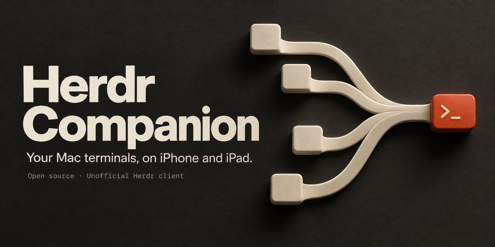
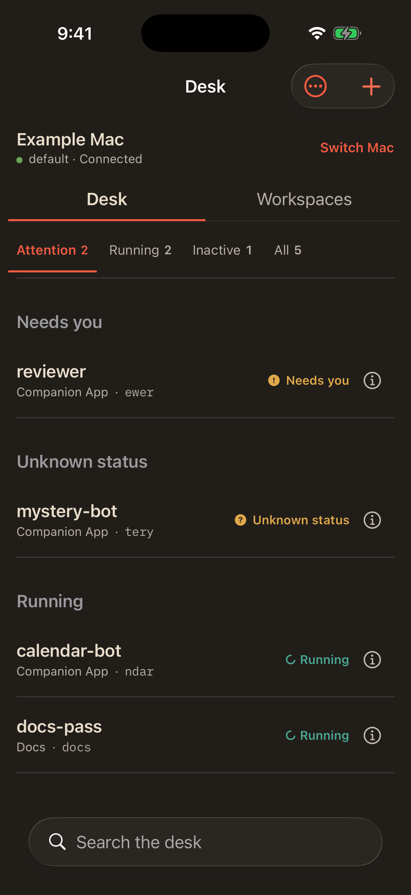
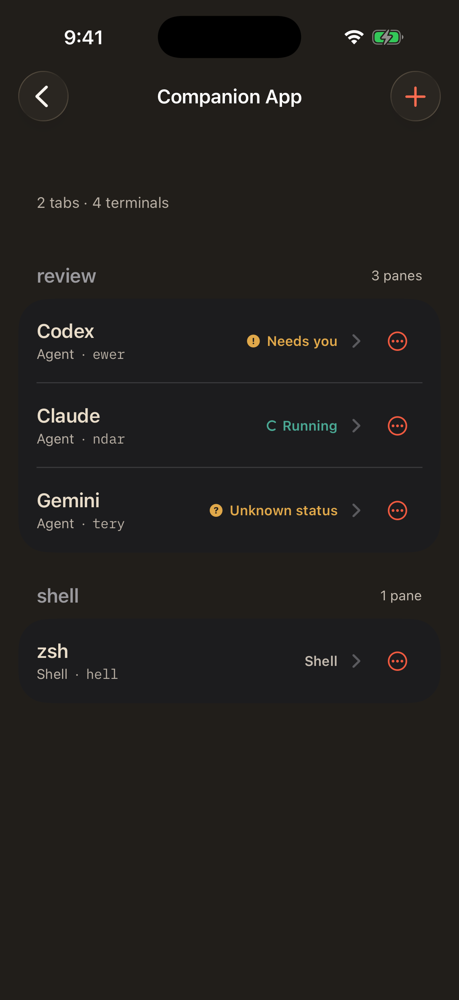
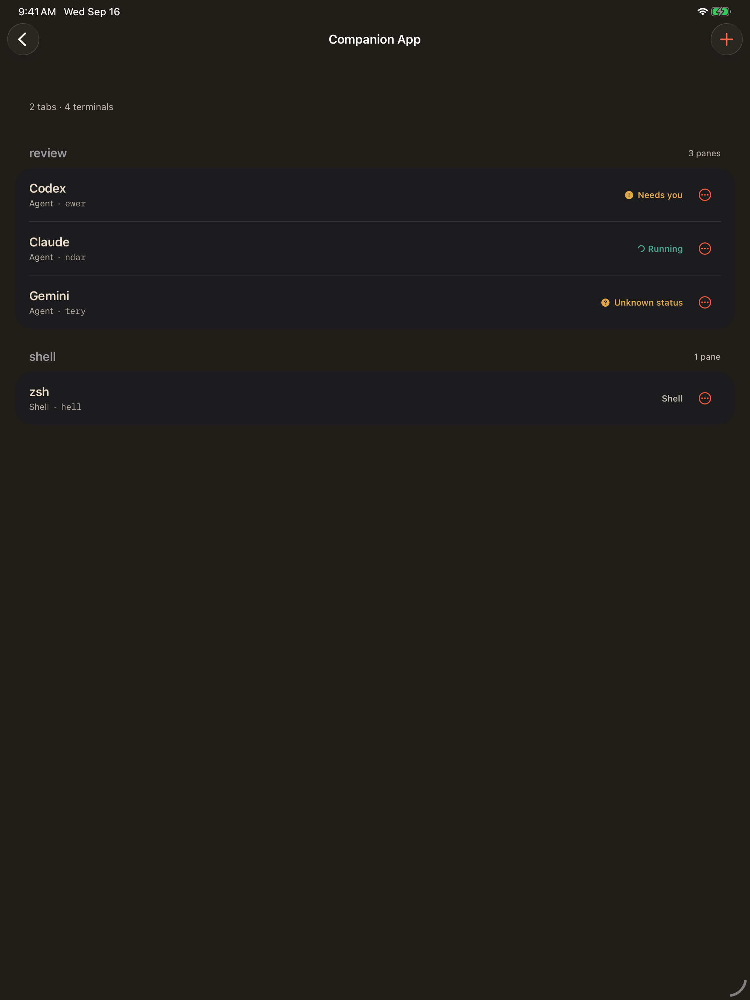

<p align="center">
  
</p>

# Herdr Companion

Unofficial iPhone and iPad client for a [Herdr](https://herdr.dev) server on
your Mac. It talks to that Mac over SSH. There is no Herdr relay, cloud
account, or telemetry.

This is not official Herdr. Elysium Technologies publishes it as a personal
open-source project. Official Herdr is unchanged.

[Install](#install) · [Connect](#connect) · [Limits](#limits) · [Notifications](#optional-notifications) · [Credits](#credits)

## Screenshots

These are the real app, running from a DEBUG visual fixture with synthetic
Example Mac data. They are not a live SSH session.

<p>
  
  
</p>

<details>
<summary>See the iPad layout</summary>

<p>
  
</p>

</details>

See [docs/images/ATTRIBUTION.md](docs/images/ATTRIBUTION.md) for what these
files are.

## What it does

- Saves SSH hosts (nickname, address, user, Herdr session, key or password).
  Secrets stay in the device Keychain.
- Pins the first successful host key. A later mismatch needs an explicit
  confirmation.
- Shows a grouped desk of agents that need you, are running, or are idle.
- Browses workspaces, tabs, and panes. Creates a workspace, terminal tab, or
  split with an explicit folder. The companion does not use Mac focus to pick
  a folder.
- Attaches to a pane. Agent panes use `herdr agent attach`; plain panes use
  `herdr terminal attach`. Both run in a dedicated SSH PTY.
- Optional image attach uploads to a private app-owned directory on that Mac
  and inserts the path only after you tap. Insertion does not send Return.

Connection failures are shown without logging credentials.

## What you need

Tested against official Herdr **0.9.0** (protocol **22**). Newer Herdr
releases are not claimed compatible.

- A Mac running that Herdr version.
- SSH from the iPhone or iPad to that Mac. The device has to be able to
  reach the host already: same LAN, or a VPN/mesh address you already use
  (Tailscale and similar are fine). Do not expose SSH to the public internet
  for this app.
- Xcode 26.5 and XcodeGen 2.46 or newer to generate and compile this
  checkout. The app target is iOS 17.

On the Mac:

```bash
herdr --version
herdr status server
```

The standard session name is `default`. A named session can be selected on a
saved host; the same session is used for the JSON control socket and terminal
attachment.

## Install

```bash
git clone https://github.com/rkvhtd/herdr-companion.git
cd herdr-companion
```

The Xcode project is generated and is not committed. `project.yml` leaves
`DEVELOPMENT_TEAM` empty. There is no App Store or TestFlight build.

### Simulator

A simulator run does not need an Apple Developer team.

```bash
xcodegen generate
open HerdrCompanion.xcodeproj
```

In Xcode, select the HerdrCompanion scheme and a simulator, then Run.

An unsigned command-line build is under [Development](#development).

### Physical device

The committed app identifier is `com.elysium.herdrcompanion`. That App ID
belongs to the publisher. If you are not signing with the publisher's Apple
team, change all three `PRODUCT_BUNDLE_IDENTIFIER` values in `project.yml`
to unique identifiers your team controls before you run `xcodegen generate`.
Those settings are:

| Target | `PRODUCT_BUNDLE_IDENTIFIER` today | Example replacement |
| --- | --- | --- |
| HerdrCompanion | `com.elysium.herdrcompanion` | `com.example.herdrcompanion` |
| HerdrCompanionTests | `com.elysium.herdrcompanion.tests` | `com.example.herdrcompanion.tests` |
| HerdrCompanionUITests | `com.elysium.herdrcompanion.uitests` | `com.example.herdrcompanion.uitests` |

Use your own reverse-DNS names, not `com.example` and not the publisher IDs.
Do this for a fresh clone as well as a fork.

Then generate and open:

```bash
xcodegen generate
open HerdrCompanion.xcodeproj
```

Select the HerdrCompanion scheme, choose your Apple Developer team, keep
automatic signing, connect and select your device, and Run.

If you edit `project.yml` after generating, run `xcodegen generate` again.
Signing choices made only in Xcode are not stored in `project.yml`; a later
generate can overwrite them. Keep identifier changes in `project.yml` so they
survive regeneration.

The current device target always requests the `aps-environment` entitlement,
so the App ID and provisioning profile for a physical device need the Push
Notifications capability even if you never turn on alerts. A profile without
that capability can fail signing or provisioning before the app launches.
Runtime notification use remains optional. Debug uses the APNs `development`
environment; Release uses `production`. Real APNs delivery is not verified
by the tests in this repository.

The current device target requires an Apple Developer Program team with Push
Notifications support. A free Personal Team cannot provision this unchanged
entitlement. See Apple's [supported capabilities for iOS](https://developer.apple.com/help/account/reference/supported-capabilities-ios).

Do not reuse another publisher's team or App ID.

## Connect

1. Save a nickname, SSH address (`host` or `host:port`), username, Herdr
   session, and either a private key or a password.
2. Connect. The first successful host key is pinned. A later mismatch needs an explicit confirmation.
3. Browse workspaces, tabs, and panes, or open an agent from the desk.
4. Attach to a pane when you want the live terminal.

The phone or iPad only needs to reach that Mac's SSH the same way you
already would from another machine on your network. Keep port 22 off the
public internet.

## Limits

Included: saved SSH hosts, host-key pinning, official topology,
workspace/tab/split creation, official terminal attachment, optional
self-hosted APNs helper.

Not included: creating agents; closing or renaming workspaces, tabs, or
panes; arbitrary remote file browsing; automatic folder creation; non-image
uploads; VPN switching; server account or update management; session
migration; fork-only messaging APIs; App Store or TestFlight distribution.

## Optional notifications

Sending alerts needs a physical iPhone or iPad, an APNs token-signing key,
and a helper on every saved Mac that should send those alerts. Simulator
builds check UI and routing. They are not evidence of a real APNs delivery.

Setup: [docs/notifications-setup.md](docs/notifications-setup.md).
Protocol: [docs/notifications-protocol.md](docs/notifications-protocol.md).

Helper installation copies only paths you supply. It does not search for
Apple accounts or keys.

## Development

This is a bounded personal project. Issues and pull requests for defects in
the published sources are welcome. There is no support SLA, roadmap promise,
sponsorship program, or hosted extra service.

<details>
<summary>Unsigned simulator build and package tests</summary>

The Xcode project is generated and is not committed.

```bash
xcodegen generate

xcodebuild \
  -project HerdrCompanion.xcodeproj \
  -scheme HerdrCompanion \
  -destination 'generic/platform=iOS Simulator' \
  -derivedDataPath "$PWD/.derivedData" \
  CODE_SIGNING_ALLOWED=NO \
  build
```

Optional Mac helper, only if you want notifications later:

```bash
swift build -c release --product herdr-notification-helper
```

Safe default package tests do not use workstation SSH keys, the default
Herdr session, or port 22:

```bash
swift test --filter OfficialCompanionTests
swift test --filter LiveEnvironmentTests
swift test --filter CitadelTransportTests \
  --skip CitadelTransportTests/testConnectFailsWithinTheBudgetAgainstABlackHoleAddress
```

`HerdrCompanionTests` is in the generated Xcode scheme and covers connection
generation, cancellation, mutation failures, and host-key recovery.

Live SSH/Herdr tests require an explicit disposable fixture
(`HERDR_COMPANION_LIVE_SSH=1` or `HERDR_COMPANION_INTEGRATION=1` plus isolated
`HERDR_COMPANION_FIXTURE_*` values). They refuse port 22, non-loopback hosts,
the default session, and keys outside
`/private/tmp/herdr-companion-ssh-fixture.*`. Do not point them at a personal
Mac.

</details>

## Credits

Derived from [Herdrup](https://github.com/jerryfane/herdrup) at commit
[`93c6578666e656c3206661389e81853bcc0b88da`](https://github.com/jerryfane/herdrup/commit/93c6578666e656c3206661389e81853bcc0b88da)
([Apache-2.0](https://github.com/jerryfane/herdrup/blob/93c6578/LICENSE)).

Companion-specific sources live mainly in `App/`,
`Sources/HerdrNotificationHelper`, `Sources/HerdrNotificationHelperCore`,
`Tests/HerdrCompanionTests`, `Tests/HerdrCompanionUITests`, and
`Tests/HerdrNotificationHelperTests`. They replace the inherited Herdrup iOS
shell with a narrower official-Herdr workflow. `Sources/HerdrKit` is the
retained and modified protocol/transport layer. Vendored SwiftTerm is
unchanged in origin.

Apache-2.0. See [LICENSE](LICENSE) and [NOTICE](NOTICE). App icon
replacement provenance is in
[App/Assets.xcassets/ATTRIBUTION.md](App/Assets.xcassets/ATTRIBUTION.md).
Landing images are described in
[docs/images/ATTRIBUTION.md](docs/images/ATTRIBUTION.md).

## Security reports

Do not put private keys, pairing codes, device tokens, `.p8` files,
passwords, or someone else's host names into public issues. This repository
does not publish a dedicated vulnerability inbox. Describe a bug without
attaching secrets.
